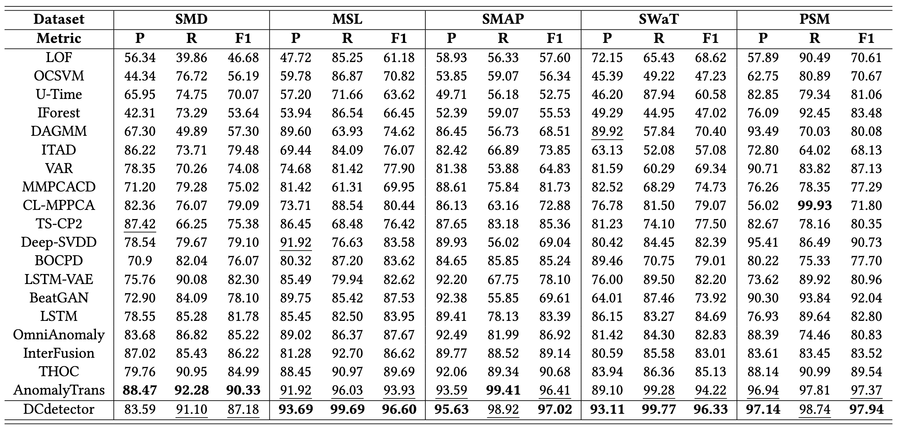

# DCdetector (KDD 2023 research track paper)

**DCdetector: Dual Attention Contrastive Representation Learning for Time Series Anomaly Detection**
[[Paper]](https://arxiv.org/abs/2306.10347)


The most fundamental challenge for time series anomaly detection is to learn a representation map that enables effective discrimination of anomalies. Reconstruction-based methods still dominate, but the representation learning with anomalies might hurt the performance with its large abnormal loss. In this paper, we propose DCdetector, a multi-scale dual attention contrastive representation learning model.

- **Overall**: DCdetector utilizes a novel dual attention asymmetric design to create the permutated environment and pure contrastive loss to guide the learning process, thus learning a permutation invariant representation with superior discrimination abilities.

- **Architecture**: A contrastive learning-based dual-branch attention structure is designed to learn a permutation invariant representation that enlarges the representation differences between normal points and anomalies.

- **Architecture**: Two additional structures are designed for time series. Channel independence patching is proposed to enhance local semantic information in time series. Multi-scale is proposed in the attention module to reduce information loss during patching.

- **Optimization**: An effective and robust loss function is designed based on the similarity of two branches. Note that the model is trained purely contrastively without reconstruction loss, which reduces distractions from anomalies.

- **Performance & Justification**: DCdetector achieves performance comparable or superior to SOTA methods on eight time series anomaly detection benchmark datasets. We also provide justification discussion to explain how our model avoids collapse without negative samples.

||
|:--:| 
| *Figure 1. Architecture comparison of three approaches.* |

||
|:--:| 
| *Figure 2. The workflow of the DCdetector framework.* |


## Main Result
We compare our model with 26 baselines based on various evaluation criteria. Extensive experiments show that DCdetector achieves the best or comparable performance on eight benchmark datasets compared to various state-of-the-art algorithms.

||
|:--:| 
| *Table 1. Overall results on real-world multivariate datasets.* |

| | 
|:--:|:--:|
| *Table 2. Overall results on NIPS-TS datasets.* | *Table 3. Overall results on univariate dataset.* |

||
|:--:| 
| *Table 4. Multi-metrics results on NIPS-TS datasets.* |


## Code Description
There are ten files/folders in the source.

- data_factory: The preprocessing folder/file. All datasets preprocessing codes are here.
- dataset: The dataset folder, and you can download all datasets [here](https://drive.google.com/drive/folders/1RaIJQ8esoWuhyphhmMaH-VCDh-WIluRR?usp=sharing).
- main.py: The main python file. You can adjustment all parameters in there.
- metrics: There is the evaluation metrics code folder, which includes VUC, affiliation precision/recall pair, and other common metrics. The details can be corresponding to paper’s Section 4.2.
- model: DCdetector model folder. The details can be corresponding to paper’s Section 3.
- result: In our code demo, we can automatically save the results and train processing log in this folder.
- scripts: All datasets and ablation experiments scripts. You can reproduce the experiment results as get start shown.
- solver.py: Another python file. The training, validation, and testing processing are all in there. 
- utils: Other functions for data processing and model building.
- img: Images needed in readme.md.
- requirements.txt: Python packages needed to run this repo.


## Get Start
1. Install Python 3.6, PyTorch >= 1.4.0.
2. Download data. You can obtain all benchmarks from [Google Cloud](https://drive.google.com/drive/folders/1RaIJQ8esoWuhyphhmMaH-VCDh-WIluRR?usp=sharing). All the datasets are well pre-processed.
3. Train and evaluate. We provide the experiment scripts of all benchmarks under the folder ```./scripts```. You can reproduce the experiment results as follows:

```bash
bash ./scripts/SMD.sh
bash ./scripts/MSL.sh
bash ./scripts/SMAP.sh
bash ./scripts/PSM.sh
bash ./scripts/SWAT.sh
bash ./scripts/NIPS_TS_Swan.sh
bash ./scripts/NIPS_TS_Water.sh
bash ./scripts/UCR.sh
```

Also, some scripts of ablation experiments.

```bash
bash ./scripts/Ablation_attention_head.sh
bash ./scripts/Ablation_encoder_layer.sh
bash ./scripts/Ablation_Multiscale.sh
bash ./scripts/Ablation_Window_Size.sh
```

## Citation
If you find this repo useful, please cite our paper.

```
@inproceedings{yang2023dcdetector,
  title={DCdetector: Dual Attention Contrastive Representation Learning for Time Series Anomaly Detection},
  author={Yiyuan Yang and Chaoli Zhang and Tian Zhou and Qingsong Wen and Liang Sun},
  booktitle={Proc. 29th ACM SIGKDD International Conference on Knowledge Discovery & Data Mining (KDD 2023)},
  location = {Long Beach, CA},
  pages={3033–3045},
  year={2023}
}
```

## Contact
If you have any question or want to use the code, please contact yiyuan.yang@cs.ox.ac.uk, chaoli.zcl@alibaba-inc.com,tian.zt@alibaba-inc.com,qingsong.wen@alibaba-inc.com.

## Acknowledgement
We appreciate the following github repos a lot for their valuable code:

https://github.com/thuml/Anomaly-Transformer

https://github.com/ahstat/affiliation-metrics-py

https://github.com/TheDatumOrg/VUS

